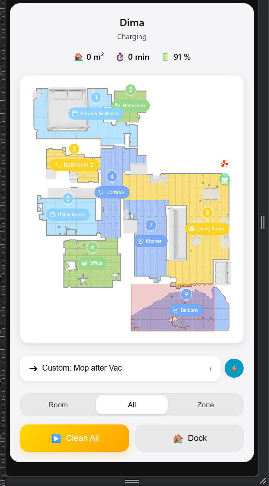
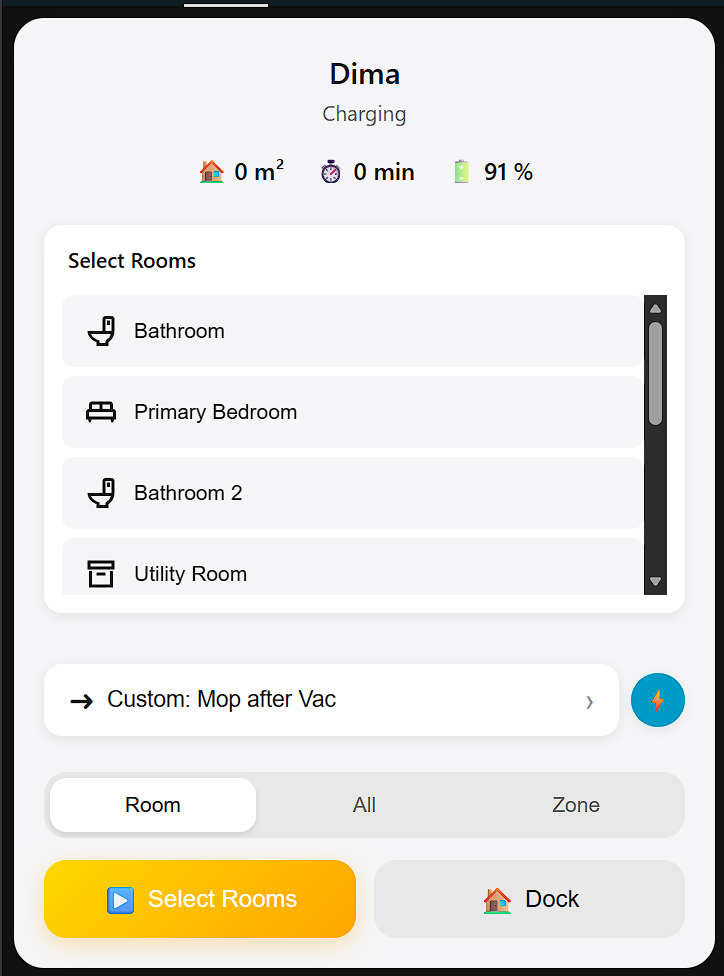
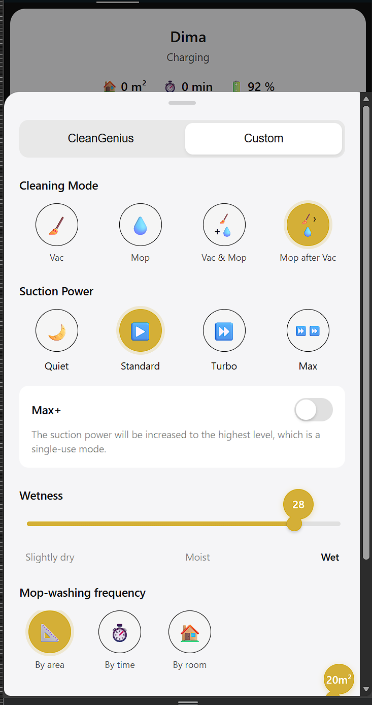

# Dreame Vacuum Map Card

A modern, beautiful Home Assistant Lovelace card for controlling Dreame robot vacuums. Built with React, TypeScript, and SCSS.

## Features

(Almost) complete feature pairity with the original Dreame application








## Installation

### 1. Download the card
Download `dreame-vacuum-map-card.js` from the releases page

### 2. Add to Home Assistant
Copy the file to your Home Assistant config directory:
```
/config/www/dreame-vacuum-map-card/dreame-vacuum-map-card.js
```

### 3. Add resource to Lovelace
Go to Settings → Dashboards → Resources → Add Resource:
- URL: `/local/dreame-vacuum-map-card/dreame-vacuum-map-card.js`
- Resource type: JavaScript Module

### 4. Add card to dashboard
```yaml
type: custom:dreame-vacuum-map-card
entity: vacuum.your_vacuum
map_entity: camera.your_vacuum_map
```

## Development

### Prerequisites
- Node.js 18+
- npm or yarn

### Setup
```bash
npm install
```

### Development Mode
```bash
npm run dev
```

### Build for Production
```bash
npm run build
```

The built file will be in `dist/dreame-vacuum-map-card.js`

## Tech Stack

- **React 19.2.0** - Modern UI library
- **TypeScript 5.9.3** - Type safety
- **Vite 7.2.4** - Fast build tool
- **SASS** - Powerful CSS preprocessor

## Requirements

- Home Assistant with the [Dreame Vacuum](https://github.com/Tasshack/dreame-vacuum) integration installed
- A supported Dreame robot vacuum

## Credits

- Original inspiration from [xiaomi-vacuum-map-card](https://github.com/PiotrMachowski/lovelace-xiaomi-vacuum-map-card)
- [Dreame Vacuum](https://github.com/Tasshack/dreame-vacuum) integration by Tasshack

## License

