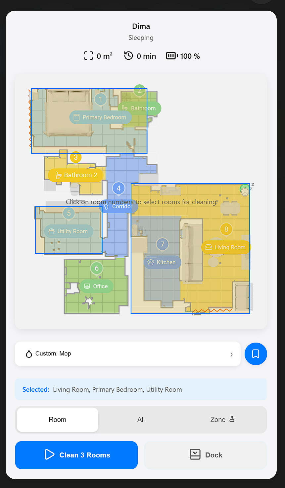
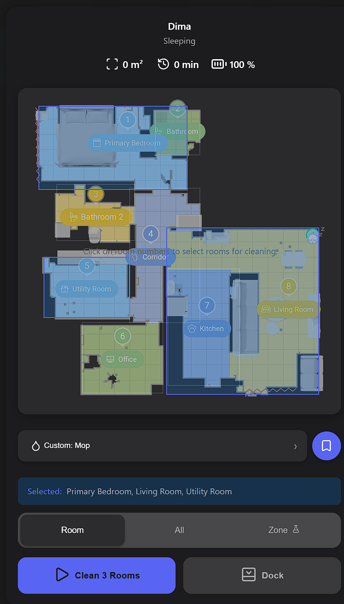

# Dreame Vacuum Map Card

A modern, beautiful Home Assistant Lovelace card for controlling Dreame robot vacuums. Built with React, TypeScript, and SCSS.

## Features

- (Almost) complete feature parity with the original Dreame application
- Support for **Room**, **All**, and **Zone** cleaning modes
- Interactive map with room and zone selection
- CleanGenius and Custom cleaning mode configuration
- Real-time vacuum status and battery level
- **Customizable Theming**: Light, dark, and fully customizable themes
- **Internationalization (i18n)**: English and German translations

<div style="display: flex; gap: 10px;">
    
    
</div>

<div style="display: flex; gap: 10px;">
    
    
</div>

<div style="display: flex; gap: 10px;">
    
    
</div>

<div style="display: flex; gap: 10px;">
    
    
</div>

<div style="display: flex; gap: 10px;">
    
    
</div>

## Installation

### 1. Download the card
Download `dreame-vacuum-map-card.js` from the releases page

### 2. Add to Home Assistant
Copy the file to your Home Assistant config directory:
```
/config/www/dreame-vacuum-map-card/dreame-vacuum-map-card.js
```

### 3. Add resource to Lovelace
Go to Settings → Dashboards → Resources → Add Resource:
- URL: `/local/dreame-vacuum-map-card/dreame-vacuum-map-card.js`
- Resource type: JavaScript Module

### 4. Add card to dashboard
```yaml
type: custom:dreame-vacuum-map-card
entity: vacuum.dreame_vacuum_entity
title: Dreame Vacuum
map_entity: camera.dreame_vacuum_entity # Optional, defaults to camera.${ENTITY_NAME}_map
theme: light # Optional, 'light' (default), 'dark', or 'custom'
language: en # Optional, 'en' (default) or 'de'
default_mode: all # Optional, 'all' (default), 'room', or 'zone'
```

## Configuration

| Name | Type | Default | Description |
|------|------|---------|-------------|
| `entity` | string | **Required** | Entity ID of your Dreame vacuum |
| `title` | string | Optional | Custom title for the card |
| `map_entity` | string | Optional | Camera entity for the vacuum map (defaults to `camera.${ENTITY_NAME}_map`) |
| `theme` | string | `light` | Theme mode: `light`, `dark`, or `custom` |
| `custom_theme` | object | Optional | Custom theme configuration (see [Theming](#theming)) |
| `language` | string | `en` | Language: `en` (English) or `de` (German) |
| `default_mode` | string | `all` | Default tab to display: `all`, `room`, or `zone` |

## Theming

The card features a comprehensive theming system with built-in and custom theme support.

### Built-in Themes

#### Light Theme (Default)
```yaml
type: custom:dreame-vacuum-map-card
entity: vacuum.dreame_vacuum_entity
theme: light
```

#### Dark Theme
```yaml
type: custom:dreame-vacuum-map-card
entity: vacuum.dreame_vacuum_entity
theme: dark
```

### Custom Themes

Create fully customized themes by extending either the light or dark theme:

```yaml
type: custom:dreame-vacuum-map-card
entity: vacuum.dreame_vacuum_entity
theme: custom
custom_theme:
  base: dark  # Extend 'dark' or 'light' theme
  accentColor: '#ff6b6b'
  accentColorHover: '#ff5252'
  accentBg: 'rgba(255, 107, 107, 0.2)'
```

#### Available Theme Properties

You can customize any of the following colors:

**Background Colors:**
- `cardBg`, `surfaceBg`, `surfaceSecondary`, `surfaceTertiary`, `surfaceBgHover`

**Text Colors:**
- `textPrimary`, `textPrimaryInvert`, `textSecondary`, `textTertiary`

**Accent Colors:**
- `accentColor`, `accentColorHover`, `accentBg`, `accentBgHover`, `accentBgSecondary`, `accentBgSecondaryHover`,  `accentBgTransparent`, `accentShadow`, `accentColorShadowColor`

**State Colors:**
- `warningColor`, `warningShadow`, `errorColor`, `errorColorHover`, `errorShadow`

**UI Elements:**
- `borderColor`, `overlayBg`, `cardShadow`, `cardShadowHover`, `handleShadow`, `handleBg`, `backdropBg`

**Toggle Specific:**
- `toggleActive`, `toggleActiveBorder`, `toggleActiveShadowColor`

### Example Custom Themes

#### Ocean Blue
```yaml
theme: custom
custom_theme:
  base: dark
  cardBg: '#0a1929'
  surfaceBg: '#132f4c'
  accentColor: '#29b6f6'
  toggleActiveBorder: '#29b6f6'
```

#### Warm Sunset
```yaml
theme: custom
custom_theme:
  base: light
  cardBg: '#fff8e1'
  accentColor: '#ff6f00'
  accentBg: '#ffe0b2'
```

#### Forest Green
```yaml
theme: custom
custom_theme:
  base: light
  cardBg: '#f1f8e9'
  accentColor: '#2e7d32'
  accentBg: '#c8e6c9'
```

For more examples and complete theming documentation, see [THEMING.md](THEMING.md).

## Internationalization (i18n)

The card supports multiple languages. Currently available:

- **English (en)** - Default
- **German (de)** - Deutsch

Set the language in your configuration:

```yaml
type: custom:dreame-vacuum-map-card
entity: vacuum.dreame_vacuum_entity
language: de
```

All user-facing text is translated, including:
- Room selection and cleaning modes
- Action buttons (Clean, Pause, Resume, Stop, Dock)
- Toast notifications
- Map overlays and instructions
- Error messages

### Adding New Languages

To add support for additional languages:

1. Create a new translation file in `src/i18n/locales/` (e.g., `fr.ts` for French)
2. Import the `Translation` type and provide translations for all keys
3. Add the new locale to `src/i18n/locales/index.ts`
4. Update the `HassConfig` type in `src/types/homeassistant.ts`

Example structure:
```typescript
import type { Translation } from './en';

export const fr: Translation = {
  room_selector: {
    title: 'Sélectionner les pièces',
    // ... more translations
  },
  // ... all other sections
};
```

## Development

### Prerequisites
- Node.js 20+
- npm or yarn

### Setup
```bash
npm install
```

### Development Mode

Run the development server with mock data:
```bash
npm run dev
```

The app will start at http://localhost:5173 with mock vacuum data automatically loaded.

#### Development with Mock API Server

If you need to test API endpoints, run the mock server separately:

**Terminal 1 - Mock Server:**
```bash
npm run mock
```

**Terminal 2 - Dev Server:**
```bash
npm run dev
```

Or run both together:
```bash
npm run dev:mock
```

#### Environment Configuration

Copy `.env.example` to `.env` and customize as needed:
```bash
cp .env.example .env
```

### Build
```bash
npm run build
```

The built file will be in `dist/dreame-vacuum-map-card.js`

## Tech Stack

- **React 19.2.0** 
- **Lucide React Icons**
- **TypeScript 5.9.3**
- **Vite 7.2.4**
- **SASS**

## Requirements

- Home Assistant with the [Dreame Vacuum](https://github.com/Tasshack/dreame-vacuum) integration installed
- A supported Dreame robot vacuum

## Credits

- Original inspiration from [xiaomi-vacuum-map-card](https://github.com/PiotrMachowski/lovelace-xiaomi-vacuum-map-card)
- [Dreame Vacuum](https://github.com/Tasshack/dreame-vacuum) integration by Tasshack

## License

MIT License - see [LICENSE](LICENSE) file for details

